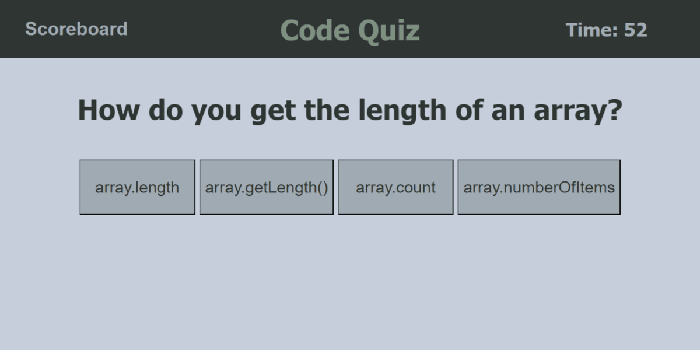
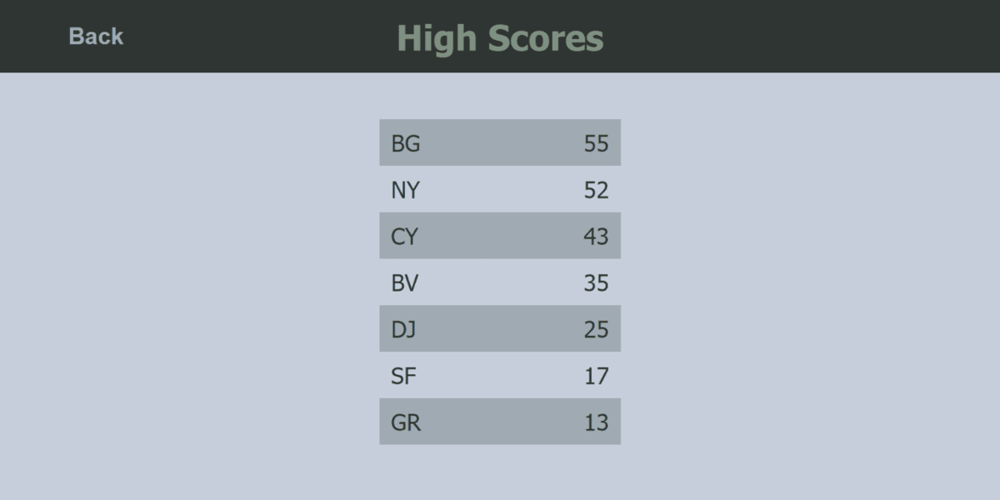

# Code Quiz

## Description

The code quiz will test your knowledge of programming topics. Every question you get wrong will subtract 10 seconds from the timer. Finish the quiz before the timer runs out to record your score.

## Links

Visit the site [here](https://gormanbrian.github.io/code-quiz)

## Screenshots

